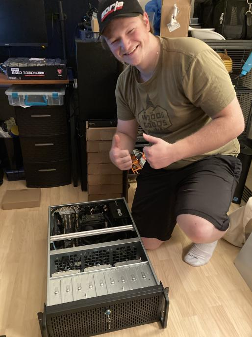

# Welcome!

## Contact Me

**Linkedin**: [Profile](https://www.linkedin.com/in/paulpgleaso)\
**Email**: [ppgleason02@gmail.com](mailto:ppgleason02@gmail.com)\
**GitHub**: [ChampPG](https://github.com/ChampPG)

## Who am I?

I’m a Champlain College student studying to be a cybersecurity professional. I have experience working with automation and scripts, SCCM, Microsoft Endpoint Configuration Manager, as well as Ansible.

My passion is securing the IT infrastructure and making sure our users follow best practices to protect their identities. Currently, I’m part of a team that supports our college’s cybersecurity needs in addition to our IT help desk.

I love learning something new everyday. In my spare time, I work on applying the concepts I learn in class and to my IT job. Additionally, I’m also working to expand my knowledge of other programming languages and AWS, as well as Security Infrastructure.

When I’m not coding or securing our IT infrastructure, I do puzzle games, racing games and watch my favorite show, Futurama.

### Resume:



<figure><figcaption>
Me right after finishing my 70Tb NAS
</figcaption></figure>

### Phone Navigation

This is because the header links won't show up on mobile devices.


[Tech Journals](http://127.0.0.1:5000/o/SgPwcFh7NBRie9TlbcZE/s/wW8hW4GgX5rPgI6Vupsq/)



[Sysadmin Wiki](http://127.0.0.1:5000/o/SgPwcFh7NBRie9TlbcZE/s/aqbxPmAvDQYpWzB6dTrS/)



[Personal Projects](http://127.0.0.1:5000/o/SgPwcFh7NBRie9TlbcZE/s/8TyySoxS9D5ngc3H5JVv/)


&#x20;Use any of the templates if you like!


[Templates](http://127.0.0.1:5000/o/SgPwcFh7NBRie9TlbcZE/s/wtr2qzY5vZLvQtK7FHTb/)

