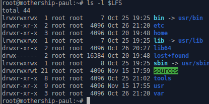

# Milestone 2

### Chapter 3 Packages and Patches using wget-list-systemd

```
sudo -i
mkdir -v $LFS/sources
chmod -v a+wt $LFS/sources
exit
cd $LFS/sources
wget https://www.linuxfromscratch.org/lfs/view/stable-systemd/wget-list-systemd
wget --input-file=wget-list-systemd --continue --directory-prefix=$LFS/sources
du -h
wget https://www.linuxfromscratch.org/lfs/view/stable-systemd/md5sums
pushd $LFS/sources
  md5sum -c md5sums
popd
```

<figure><figcaption><p>Shows expat-2.4.8 Not installed</p></figcaption></figure>

<figure><figcaption><p>Shows zlib not installed (This is due to the creators removing 1.12.2 due to a vulnerability)</p></figcaption></figure>

#### Manual Download

[https://zlib.net/zlib-1.2.13.tar.gz](https://zlib.net/zlib-1.2.13.tar.gz) As of October 13, 2022 zlib version 1.2.12 has a vulnerability so I updated to 1.2.13.

[https://sourceforge.net/projects/expat/files/expat/2.4.9/expat-2.4.9.tar.xz/download](https://sourceforge.net/projects/expat/files/expat/2.4.9/expat-2.4.9.tar.xz/download) (Previous version was labeled as critically vulnerable)

[https://www.python.org/ftp/python/3.10.8/Python-3.10.8.tar.xz](https://www.python.org/ftp/python/3.10.8/Python-3.10.8.tar.xz) (This is to fix the python vulnerability)

[https://www.python.org/ftp/python/doc/3.10.8/python-3.10.8-docs-html.tar.bz2](https://www.python.org/ftp/python/doc/3.10.8/python-3.10.8-docs-html.tar.bz2) (This is to fix the python-docs vulnerability)

#### Clean Run

To get a clean run I had to modify the md5sum file.

<figure><figcaption><p>How to get the format for the md5sum file</p></figcaption></figure>

<figure><figcaption><p>How the md5sum file looks</p></figcaption></figure>

Clean run:

<figure><figcaption><p>Showing a clean md5sum -c md5sum run</p></figcaption></figure>

### Chapter 4 - Directory Structure for LFS File System (4.2)

```
sudo -i
mkdir -pv $LFS/{etc,var} $LFS/usr/{bin,lib,sbin}

for i in bin lib sbin; do
  ln -sv usr/$i $LFS/$i
done

case $(uname -m) in
  x86_64) mkdir -pv $LFS/lib64 ;;
esac
mkdir -pv $LFS/tools
```

<figure><figcaption><p>File System ls -l</p></figcaption></figure>

### LFS User

```
sudo -i
groupadd lfs
useradd -s /bin/bash -g lfs -m -k /dev/null lfs
passwd lfs
```

#### Permissions

```
chown -v lfs $LFS/{usr{,/*},lib,var,etc,bin,sbin,tools}
case $(uname -m) in
  x86_64) chown -v lfs $LFS/lib64 ;;
esac
```

#### Switch User

```
su - lfs
```

#### Bash Profile

```
cat > ~/.bash_profile << "EOF"
exec env -i HOME=$HOME TERM=$TERM PS1='\u:\w\$ ' /bin/bash
EOF
```

#### Bashrc

```
cat > ~/.bashrc << "EOF"
set +h
umask 022
LFS=/mnt/lfs
LC_ALL=POSIX
LFS_TGT=$(uname -m)-lfs-linux-gnu
PATH=/usr/bin
if [ ! -L /bin ]; then PATH=/bin:$PATH; fi
PATH=$LFS/tools/bin:$PATH
CONFIG_SITE=$LFS/usr/share/config.site
export LFS LC_ALL LFS_TGT PATH CONFIG_SITE
EOF
```

Getting rid of /etc/bashrc

```
[ ! -r /etc/bash.bashrc ] || mv -v /etc/bash.bashrc /etc/bash.bashrc.NOUSE
```

go back to lfs

```
su - lfs
source ~/.bash_profile
echo $LFS
```

<figure><figcaption><p>LFS User output</p></figcaption></figure>

### Chapter 5 - Part 3 - Tool Chain and Temporary Tools

#### 5.2 Binutils Pass 1

<figure><figcaption></figcaption></figure>

```
cd $LFS/sources/
tar xf binutils-2.39.tar.xz
cd binutils-2.39
mkdir -v build
cd build

time { ../configure --prefix=$LFS/tools --with-sysroot=$LFS --target=$LFS_TGT --disable-nls --enable-gprofng=no --disable-werror && make && make install; }
```

<figure><figcaption><p>Build time for binutils-2.39</p></figcaption></figure>

#### 5.3.1 GCC-12.2.0 - Pass 1

```
cd /mnt/lfs/sources/
tar -xf gcc-12.2.0.tar.xz
cd gcc-12.2.0
tar -xf ../mpfr-4.1.0.tar.xz
mv -v mpfr-4.1.0 mpfr
tar -xf ../gmp-6.2.1.tar.xz
mv -v gmp-6.2.1 gmp
tar -xf ../mpc-1.2.1.tar.gz
mv -v mpc-1.2.1 mpc
```

```
case $(uname -m) in
  x86_64)
    sed -e '/m64=/s/lib64/lib/' \
        -i.orig gcc/config/i386/t-linux64
 ;;
esac
```

```
mkdir -v build
cd build

../configure                  \
    --target=$LFS_TGT         \
    --prefix=$LFS/tools       \
    --with-glibc-version=2.36 \
    --with-sysroot=$LFS       \
    --with-newlib             \
    --without-headers         \
    --disable-nls             \
    --disable-shared          \
    --disable-multilib        \
    --disable-decimal-float   \
    --disable-threads         \
    --disable-libatomic       \
    --disable-libgomp         \
    --disable-libquadmath     \
    --disable-libssp          \
    --disable-libvtv          \
    --disable-libstdcxx       \
    --enable-languages=c,c++
     
    make; make install

cd ..
cat gcc/limitx.h gcc/glimits.h gcc/limity.h > `dirname $($LFS_TGT-gcc -print-libgcc-file-name)`/install-tools/include/limits.h
```

### 5.4. Linux-5.19.2 API Headers

```
cd $LFS/sources
tar xf linux-5.19.2.tar.xz
cd linux-5.19.2
make mrproper
make headers
find usr/include -type f ! -name '*.h' -delete
cp -rv usr/include $LFS/usr
```

### 5.5. Glibc-2.36

```
cd $LFS/sources
tar xf glibc-2.36.tar.xz
cd glibc-2.36

case $(uname -m) in
    i?86)   ln -sfv ld-linux.so.2 $LFS/lib/ld-lsb.so.3
    ;;
    x86_64) ln -sfv ../lib/ld-linux-x86-64.so.2 $LFS/lib64
            ln -sfv ../lib/ld-linux-x86-64.so.2 $LFS/lib64/ld-lsb-x86-64.so.3
    ;;
esac

patch -Np1 -i ../glibc-2.36-fhs-1.patch
mkdir build; cd build
echo "rootsbindir=/usr/sbin" > configparms

../configure                             \
      --prefix=/usr                      \
      --host=$LFS_TGT                    \
      --build=$(../scripts/config.guess) \
      --enable-kernel=3.2                \
      --with-headers=$LFS/usr/include    \
      libc_cv_slibdir=/usr/lib

make
make DESTDIR=$LFS install
```
